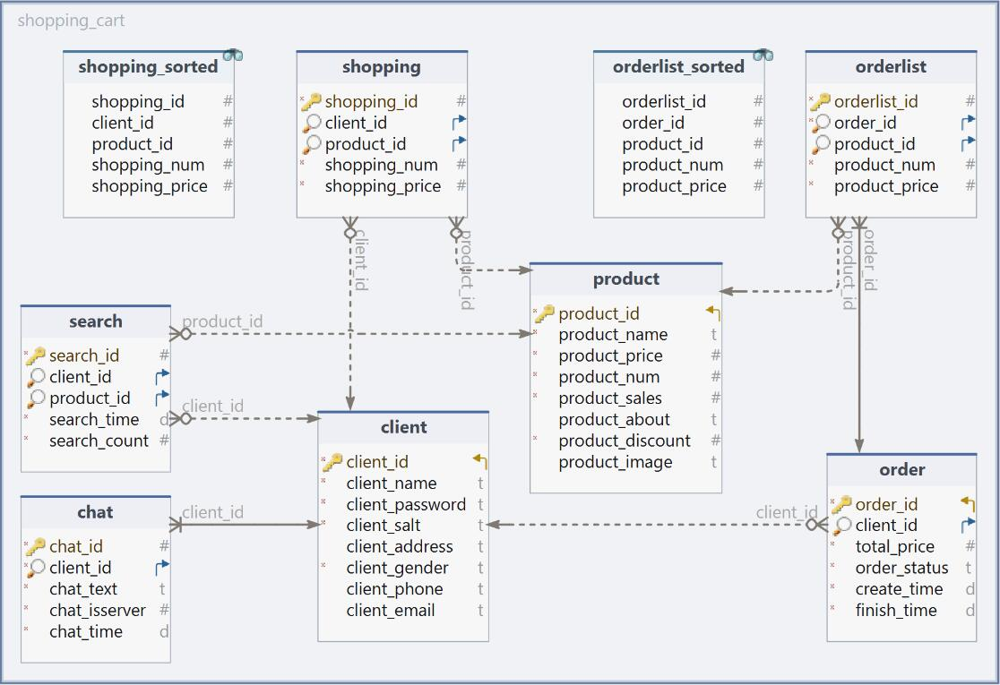

# 第二周报告

- 55230414 彭诚


## 数据库设计




### 1. client 表

- 用户信息表

|      列名       |    备注    |       类型       | 是否NULL |        其他属性        |
| :-------------: | :--------: | :--------------: | :------: | :--------------------: |
|    client_id    |   客户id   |       int        | NOT NULL | 主键、无符号、自动递增 |
|   client_name   |  客户名称  |     varchar      | NOT NULL |          utf8          |
| client_password |  客户密码  |     varchar      | NOT NULL |          utf8          |
|   client_salt   |  客户盐值  |     varchar      | NOT NULL |          utf8          |
| client_address  |  客户地址  |     varchar      |   NULL   |          utf8          |
|  client_gender  |  客户性别  | enum{男,女,未知} | NOT NULL |    utf8、默认：未知    |
|  client_phone   | 客户手机号 |     varchar      |   NULL   |          utf8          |
|  client_email   |  客户邮箱  |     varchar      |   NULL   |          utf8          |
|  client_image   |  客户头像  |     varchar      |   NULL   |          utf8          |

- client_id 为主键且自动递增，作为识别客户的唯一关键。
- 用户名不能为空，性别无法置空（默认为“未知”），其余列可以为空。
- client_image 存照片的绝对地址，所有照片都是这种存法。
- 为了满足数据库中不能存密码明文的原则，我使用了sha256哈希加密算法，在数据库中存储密文。同时引入加盐值 salt 加强加密的安全性，保证两个密码即使一样，在加密之后也会不同。具体加密算法如下：

```c++
QString Allmain::generateRandomSalt(int length)
{
    QByteArray salt;
    salt.resize(length);
    for (int i = 0; i < length; ++i) {
        salt[i] = static_cast<char>(QRandomGenerator::global()->bounded(0, 256));
    }
    return QString::fromUtf8(salt.toHex());
}
```

- 生成了指定长度的 salt 值

```c++
QString Allmain::sha256Hash(const QString &data, const QString &salt)
{
    QByteArray combinedData = data.toUtf8() + salt.toUtf8();
    QByteArray hash = QCryptographicHash::hash(combinedData, QCryptographicHash::Sha256);
    return QString::fromUtf8(hash.toHex());
}
```

- 完成加盐 sha256哈希加密，同时保存成 hex 16进制形式。既处理了加密之后出现的 QString 无法打印的字符，又实现了定长，使格式更加整齐，方便后续需要。


### 2. product 表

- 商品信息表

|       列名       |   备注   |  类型   | 是否NULL |        其他属性        |
| :--------------: | :------: | :-----: | :------: | :--------------------: |
|    product_id    |  商品id  |   int   | NOT NULL | 主键、无符号、自动递增 |
|   product_name   | 商品名称 | varchar | NOT NULL |          utf8          |
|  product_price   | 商品价格 | double  | NOT NULL |         无符号         |
|   product_num    | 商品存量 |   int   | NOT NULL |    无符号、默认：0     |
|  product_sales   | 商品销量 |   int   | NOT NULL |    无符号、默认：0     |
|  product_about   | 商品描述 |  text   |   NULL   |          utf8          |
| product_discount | 商品折扣 |   int   | NOT NULL |   无符号、默认：100    |
|  product_image   | 商品图片 | varchar |   NULL   |          utf8          |

- product_id 为主键且自动递增，作为识别商品的唯一关键。
- 商品名和商品价格不能为空，商品数量和商品销量无法置空（默认为0），商品折扣不能为空（默认为100，即不打折），其余列可以为空。
- 商品折扣为 int 整数（$discount \in [0, 100]$），实际计算时`price * discount / 100.0`
- 商品图片存储的是图片的绝对地址


### 3. shopping 表

- 购物车表

|      列名      |     备注     |  类型  | 是否NULL |        其他属性        |
| :------------: | :----------: | :----: | :------: | :--------------------: |
|  shopping_id   |   购物车id   |  int   | NOT NULL | 主键、无符号、自动递增 |
|   client_id    | 购物车所属者 |  int   |   NULL   |         无符号         |
|   product_id   |  购物车商品  |  int   |   NULL   |         无符号         |
|  shopping_num  |   商品数量   |  int   | NOT NULL |    无符号、默认：1     |
| shopping_price |   商品价格   | double | NOT NULL |         无符号         |

- product_id 为主键且自动递增
- 商品数量：客户希望购买多少件商品，非空，默认：1
- 商品价格：客户加入购物车时商品的价格，用于后续比较价格的变化，非空，不可修改

- client_id, product_id 为两个外键

| 字段       | 被引用表 | 被引用字段 | 删除时   | 更新时   |
| ---------- | -------- | ---------- | -------- | -------- |
| client_id  | client   | client_id  | SET NULL | RESTRICT |
| product_id | product  | product_id | SET NULL | RESTRICT |

- 通过外键，实现当用户或商品被删除时，对应的购物车被置空，造成逻辑删除。但是在后续商家统计数据时，该记录还可以利用。
- 新建一个视图方便购物车的逻辑查询

```mysql
SELECT * FROM shopping order by shopping.client_id
```

- 由于 client_id 的主键性质，在找到当前id之后，后续连续的商品都是该用户购物车中的商品，提高搜索效率。


### 4. order 表

- 订单记录表

|     列名     |     备注     |                        类型                        | 是否NULL |        其他属性        |
| :----------: | :----------: | :------------------------------------------------: | :------: | :--------------------: |
|   order_id   |    订单id    |                        int                         | NOT NULL | 主键、无符号、自动递增 |
|  client_id   |  订单用户id  |                        int                         |   NULL   |         无符号         |
| total_price  |   订单总价   |                       double                       | NOT NULL |         无符号         |
| order_status |   订单状态   | enum{'未支付','已支付','已完成','已取消','已退款'} | NOT NULL |          utf8          |
| create_time  | 订单下单时间 |                      datetime                      | NOT NULL |                        |
| finish_time  | 订单完成时间 |                      datetime                      | NOT NULL |                        |

- 订单在我的系统中属于“快照“，只会存下下单时相关属性，并不会更新。order_id 为主键且自动递增
- 订单快照中会存储：订单的总价，下单时间，完成时间以及订单状态。
- client_id 为外键

| 字段      | 被引用表 | 被引用字段 | 删除时   | 更新时   |
| --------- | -------- | ---------- | -------- | -------- |
| client_id | client   | client_id  | SET NULL | RESTRICT |

- 实现当客户被删除时，这条订单被逻辑删除，只作为数据统计


### 5. orderlist 表

- 订单记录详情表

|     列名      |    备注    |  类型  | 是否NULL |        其他属性        |
| :-----------: | :--------: | :----: | :------: | :--------------------: |
| orderlist_id  | 订单详情id |  int   | NOT NULL | 主键、无符号、自动递增 |
|   order_id    |   订单id   |  int   | NOT NULL |         无符号         |
|  product_id   |   商品id   |  int   |   NULL   |         无符号         |
|  product_num  |  商品数量  |  int   | NOT NULL |    无符号，默认：1     |
| product_price |  商品价格  | double | NOT NULL |         无符号         |

- orderlist_id 为主键且自动递增
- 商品数量：客户希望购买多少件商品，非空，默认：1
- 商品价格：客户加入购物车时商品的价格，用于后续比较价格的变化，非空，不可修改
- order_id, product_id 为外键

|    字段    | 被引用表 | 被引用字段 |  删除时  |  更新时  |
| :--------: | :------: | :--------: | :------: | :------: |
|  order_id  |  order   |  order_id  | RESTRICT | RESTRICT |
| product_id | product  | product_id | SET NULL | RESTRICT |

- 实现当商品被删除时，这条订单被逻辑删除，只作为数据统计
- 拒绝 order_id 被删除，实际上也不会被删除，加一道保险
- 新建一个视图方便订单详情的逻辑查询

```mysql
SELECT * FROM orderlist order by orderlist.order_id
```
- 实际查询逻辑与购物车类似，在找到当前id之后，后续连续的商品都是该用户购物车中的商品，提高搜索效率。


### 6. search 表

- 搜索记录表

|     列名     |     备注     |   类型   | 是否NULL |        其他属性        |
| :----------: | :----------: | :------: | :------: | :--------------------: |
|  search_id   |  搜索记录id  |   int    | NOT NULL | 主键、无符号、自动递增 |
|  client_id   |  搜索用户id  |   int    |   NULL   |         无符号         |
|  product_id  |  搜索商品id  |   int    |   NULL   |         无符号         |
| search_time  | 最新搜索时间 | datetime | NOT NULL |                        |
| search_count |   搜索次数   |   int    | NOT NULL |    无符号，默认：1     |

- search_id 为主键且自动递增
- 搜索时间存储最近一次搜索的时间
- 搜索记录需要实现合并功能，同一个用户搜索的同一个商品，不新生成记录，而是与之前的记录合并。
- client_id, product_id 为两个外键

| 字段       | 被引用表 | 被引用字段 | 删除时   | 更新时   |
| ---------- | -------- | ---------- | -------- | -------- |
| client_id  | client   | client_id  | SET NULL | RESTRICT |
| product_id | product  | product_id | SET NULL | RESTRICT |

- 通过外键，实现当用户或商品被删除时，对应的购物车被置空，造成逻辑删除。但是在后续商家统计数据时，该记录还可以利用。


### 7. chat 表

- 聊天记录表
|     列名      |        备注        |   类型   | 是否NULL |        其他属性        |
| :-----------: | :----------------: | :------: | :------: | :--------------------: |
|    chat_id    |     聊天记录id     |   int    | NOT NULL | 主键、无符号、自动递增 |
|   client_id   |     聊天用户id     |   int    | NOT NULL |      无符号、外键      |
|   chat_text   |      聊天记录      |   text   | NOT NULL |          utf8          |
| chat_isserver | 是否客服发送的信息 | tinyint  | NOT NULL |        默认：0         |
|   chat_time   |      聊天时间      | datetime | NOT NULL |                        |

- search_id 为主键且自动递增
- chat_isserver 用于标记是 Server 发送的信息还是 Client 发送的。
- client_id 为外键

|   字段    | 被引用表 | 被引用字段 | 删除时  |  更新时  |
| :-------: | :------: | :--------: | :-----: | :------: |
| client_id |  client  | client_id  | CASCADE | RESTRICT |

- 这里有一个特殊设计：当用户被删除时，他的聊天记录也会别删除。为了尊重用户隐私，而且聊天记录没有利用价值。于是，聊天记录会随着 client_id 的删除而被删除。


## 业务层

### socket 通讯、ThreadPool 多线程

#### Client 端

- 基本所有 socket 操作都在主类中进行
- Host 连接
  - 在主类的构造函数中完成对 Host 的连接
  - 并完成所有 socket 信号与槽函数的连接

```c++
void Allmain::connectToServer()
{
    QString server_IP = "127.0.0.1";
    int port = 23333;
    socket->connectToHost(server_IP, port);
    connect(socket, &QTcpSocket::readyRead, this, &Allmain::on_readyRead);
    connect(socket, &QTcpSocket::stateChanged, this, &Allmain::on_stateChanged);

    connect(socket, &QTcpSocket::connected, [=](){
        qDebug() << "[socket] new Connected: ";
        qDebug() << "Addr:" << socket->peerAddress();
        qDebug() << "Port:" << socket->peerPort();
    });
    connect(socket, &QTcpSocket::disconnected, [=](){
        qDebug() << "[socket] disconnected";
        socket->deleteLater();
    });
    connect(socket, QOverload<QAbstractSocket::SocketError>::of(&QAbstractSocket::error), [=](){
        qDebug() << "[socket] error:" << socket->errorString();
    });
}
```

- 发送请求：
  - 在 Client 端中的类在需要发送 socket 请求时，发送信号。
  - Allmain 类中初始连接好这些信号，接收并统一发送 socket 请求。

```c++
void Allmain::onSendToServer(QByteArray array)
{
    qDebug() << "[socket] send to Server ...";
    socket->write(array);
}
```

- 接受请求
  - 在连接时即绑定了 readyRead 信号和他的槽函数
  - 调用槽函数，完成数据的解析和处理

```c++
void Allmain::dealMessage(QByteArray message)
{
    int signal = ObjectToJson::parseSignal(message).toInt();
    qDebug() << signal;
    switch(signal) {
		/*对应不同的 signal，处理信号*/
    }
}
```


#### Server 端

- 关于 socket 的处理逻辑基本与 Client 端相同。
- 在 server 接收到一个新的连接时，我的多线程处理思路是：
  - 正常排队连接每一个新连接的 socket
  - 把他们存入一个 Qlist 中存储起来
  - 并做好初始化，连接好信号与槽函数

- 当一个 socket 发送来 readyRead 信号，进入槽函数
  - 这个槽函数会启动一个新的进程，处理当前 socket 发来的信息
  - 并把这个进程放入进程池中统一管理

```c++
void Allmain::onNewConnection()
{
    QTcpSocket *socket = server->nextPendingConnection();
    qDebug() << "[server] receive new connection ...";
    connect(socket, &QTcpSocket::readyRead,[this, socket](){
        qDebug() << "[server] receive message...";
        //接受到通讯请求，启动新的线程处理请求
        //QTcpSocket *socket = qobject_cast<QTcpSocket*>(sender());
        connect(this, &Allmain::sigSendToClient, this, &Allmain::on_sendToClient);

        threadPool->enqueue([this, socket]{
            qDebug() << "[threadPool] create a new thread";
            while(socket->bytesAvailable() > 0)
            {
                qDebug() << "[server] message available...";
                QByteArray datagram;
                datagram = socket->readAll();
                dealMessage(socket, datagram, this->threadPool->getThreadName());
            }
        });
    });
  	/*省略若干 connect() 函数*/
    sockets.append(sockets);
}
```

```c++
void Allmain::dealMessage(QTcpSocket* socket, QByteArray &message, size_t threadName)
{
    qDebug() << QString("[thread_%1]|[server] deal with message ...").arg(threadName);

    QSqlDatabase db;
    db = QSqlDatabase::addDatabase("QODBC", QString::number(threadName));
    db.setHostName("localhost");
    db.setPort(3306);
    db.setDatabaseName("MySql");
    db.setUserName("root");
    db.setPassword("pengcheng_050210");

    if(!db.open()) {
        qDebug() << QString("[thread_%1]|[database] Failed to connect to db: ").arg(threadName) << db.lastError();
        return;
    }
    qDebug() << QString("[thread_%1]|[database] Connected to MySql").arg(threadName);

    Client* client = new Client;
    int signal = ObjectToJson::parseSignal(message).toInt();
    qDebug() << signal;
    switch(signal) {
		/*对应不同的 signal，处理信号*/
    }

    db.close();    							
  QSqlDatabase::removeDatabase(QString::number(threadName));
    qDebug() << QString("[thread_%1]|[database] disconnect to database").arg(threadName);
}
```

>多线程注意事项：
>
>1. 原因
>   1. 需要多线程的原因是多个 Client 端连接上 Server 时，在处理数据时会有很大的压力
>   2. 每个 Client 的请求都开一个新线程来处理，提高程序效率，利用率，达到更好的负载均衡。
>   3. 再使用线程池来管理线程，让子线程不要空跑，提高子线程的利用率。同时也能更好地管理，进行统一顺序地上锁，注销。保障线程安全。
>   4. 线程池借鉴于 github 上的开源项目，我自己修改增加了线程名称，用于标记不同的子线程。
>2. 子线程限制
>   1. 不许直接操作 UI，否则线程会很慢
>   2. 不许使用 socket 通讯。这一点十分重要。在我的程序中，我的解决办法是：
>      1. 当前线程需要发送请求时，发送信号，由主线程统一处理，不阻塞子线程。
>   3. 不许使用主线程的数据库。由于数据库的接口越多越好，我的解决办法是：
>      1. 在每个线程开始时，才连接上数据库，并把这个接口以当前线程的名称标记。当前进程中只使用此接口。
>      2. 把数据库操作设计为原子操作，放置资源竞争和冲突。
>      3. 处理完数据，及时删除这个接口和连接。