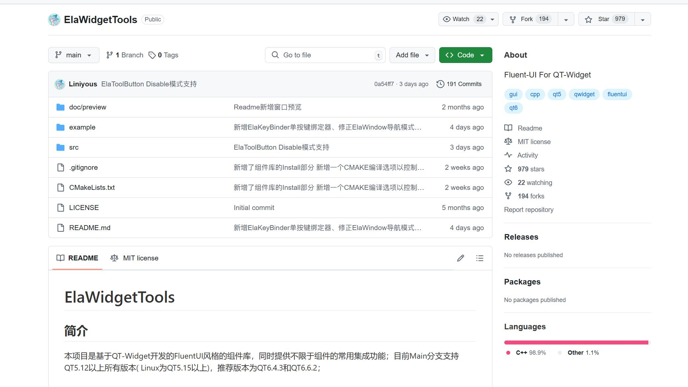
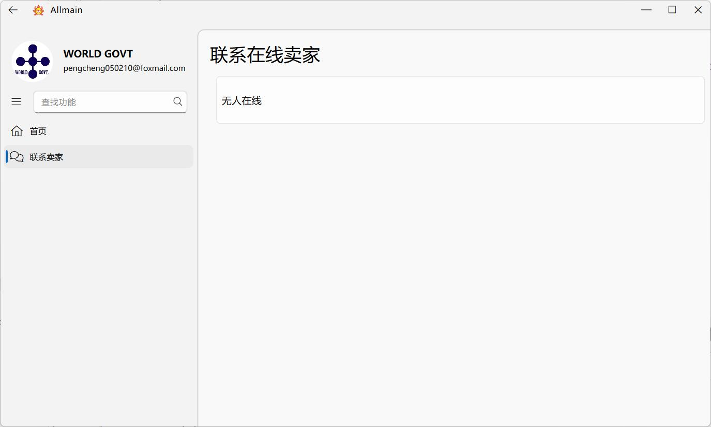
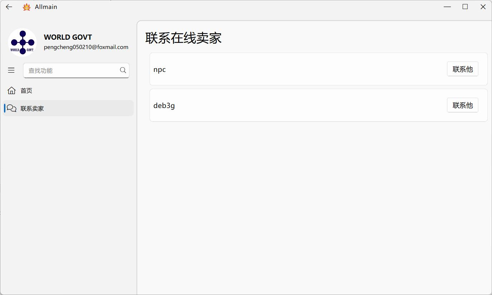
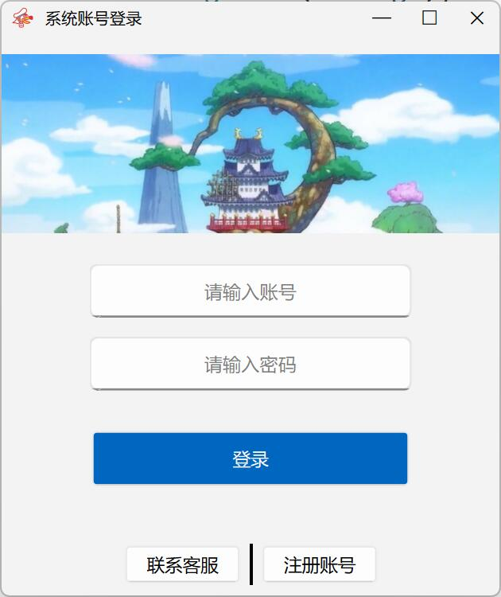
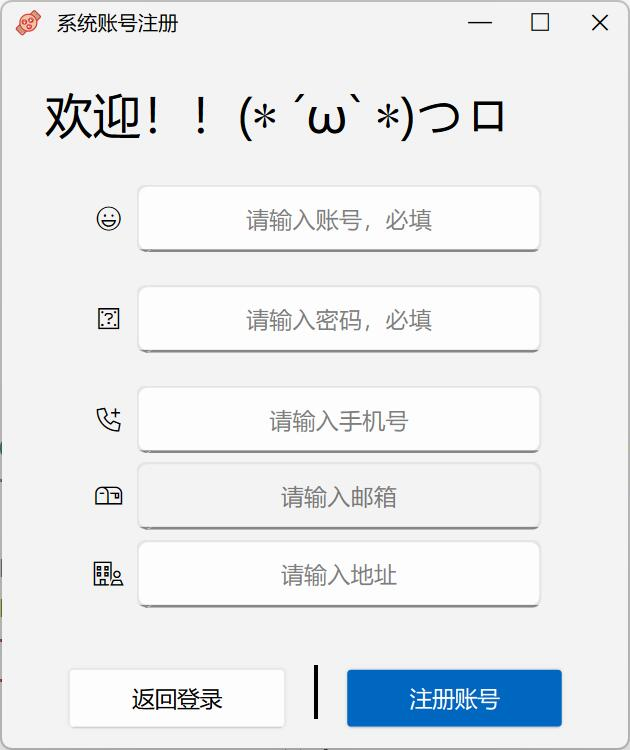
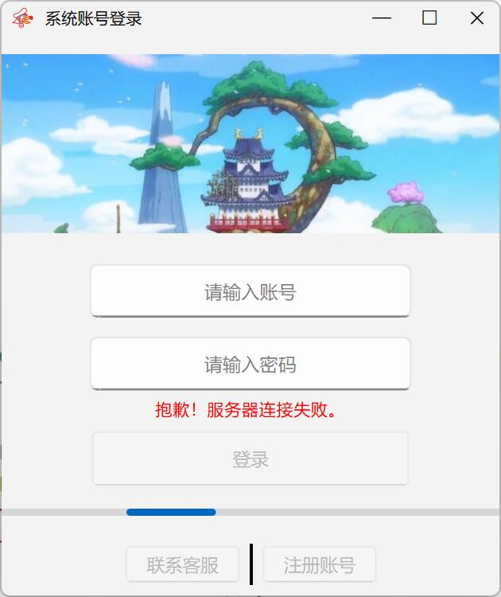
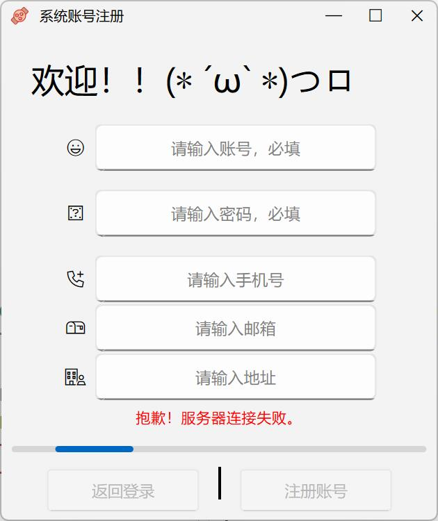

# 第三周课设报告

## 本周汇报总结

- 第三周主要完成的工程：Object对象的基本实现、DAO层的基本转换、登录注册系统的全部功能和UI
- Object对象按照数据库的设计，完成了对应的Class类的设计。并实现了一些基本的功能（商品的促销策略等）
- 基本实现了DAO的所有数据转对象的操作。完成了基本的`SqlQuery` 语句。完成了测试。
- 设计好了所有界面的UI。并学习了 ElaWidgetTools开源库，清楚了解了QT UI界面开发的基本流程与操作。

## 详细汇报

### 各类对象

- 对应数据库中的每个表，设计对象。并实现一些基本操作

```c++
class Client
{
private:
    QString clientName;
    int clientId;
    /* ... */

public:
    Client();
    Client(
            QString clientName,
            int clientId,
            /* ... */
            );
    void setClientId(int clientId);
    void setClientName(const QString &clientName);
    /* ... */

    int getClientBought() const;
    QString getClientPwd() const;
   /* ... */
};
```


### DAO层

- 由上文可知，与数据库连接的类，需要针对不同的数据库接口。而且，若没有指定接口会很危险。所以所有DAO层的类都实现了一个必须需要传入数据库接口的构造函数，并且没有默认构造函数。

- 设计了一个 `Mapper` 类，实现了一些“表”层面的操作，例如删除表，回滚表……

```c++
class Mapper
{
public:
    Mapper(QSqlDatabase &database);
    void truncate(QString tableName);
    void Delete(QString tableName);
    /*还有其他功能待补充*/

protected:
    QSqlDatabase db;
};
```

- 接下来为每个类型对象（对应数据库的设计）设计类，继承 `Mapper`，将 `SqlQuery` 与 DAO 层结合。将从数据库读出的数据转成对象。

```c++
class ClientMapper : public Mapper
{
public:
    ClientMapper(QSqlDatabase &database);

public:
    Client* getClient(QSqlQuery &query);
    //DAO层，数据转对象

    QList<Client *> select(QString name);
    //通过用户名查找

    QList<Client *> select(int id);
    //通过id查找

    void insert(Client* client);
    //插入用户
};
```

- 为每一种对象都设计好 Mapper类。

```c++
Client* ClientMapper::getClient(QSqlQuery &query)
{
    Client* client = new Client();
    client->setClientId(query.value(0).toInt());
    client->setClientName(query.value(1).toString());
    /* ... */
    return client;
}
```

```c++
QList<Client *> ClientMapper::select(QString name)
{
    qDebug() << "[database] client select...";
    QSqlQuery query(db);
    query.prepare("SELECT * FROM client WHERE client_name = :name");
    query.bindValue(":name", name);
    query.exec();

    QList<Client *> ret;
    while(query.next()) {
        ret.push_back(getClient(query));
    }
    query.finish();
    return ret;
}
```


## UI 设计


		

- 大致设计好了 UI 界面的布局草图
- 使用 ElaWidgetTools 开源项目进行美化。



- 本项目是基于 QT-Widget 开发的FluentUI风格的组件库
- 提供了大量的美化 QWidget组件，在自己设计 UI界面的基础上，让界面更加好看、动态。
- 配置上使用了QT 6.5.3，经过一些自己的修改，成功并入自己的项目中，可以使用了。

### Server

#### 客服界面



- 无人在线的情况



- 有用户上线，可以联系


### Client

#### 登录注册界面



- 登录界面，输入账号密码可以登录。也可以注册账号和联系客服
- 未登录状态联系客服并不会保存聊天记录，使用的是匿名账号，可以用于找回密码之类的交流。
- 登录按钮上方有错误提示，在用户出现误操作或者非法操作时，有相应的提示。



- 注册界面，有选择的填写部分选项之后可以进行注册
- 注册成功后会返回登录界面，并自动填写注册的账号，只需要输入密码即可登录。





- 以上两个是与服务器断开连接之后的反应，所有的按键都将会无法反应。
- 在登录之后，若遇上断连情况，也会返回登录界面等待。