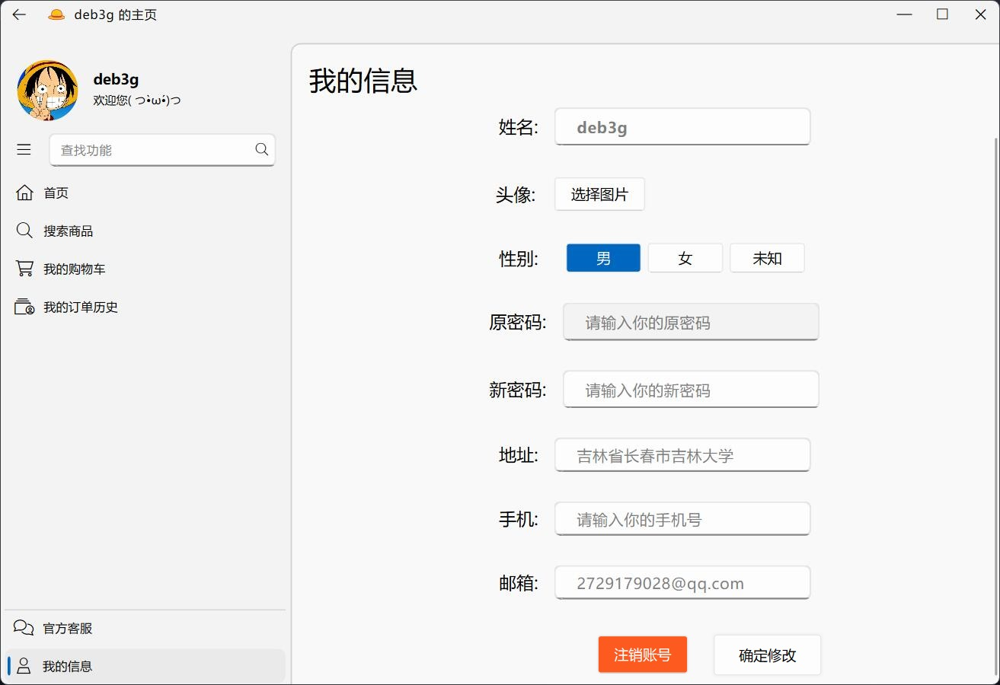
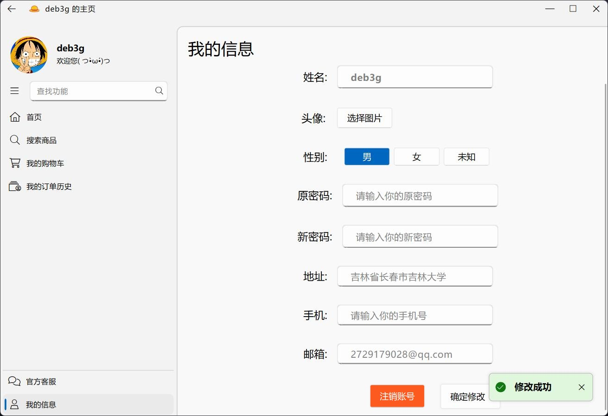
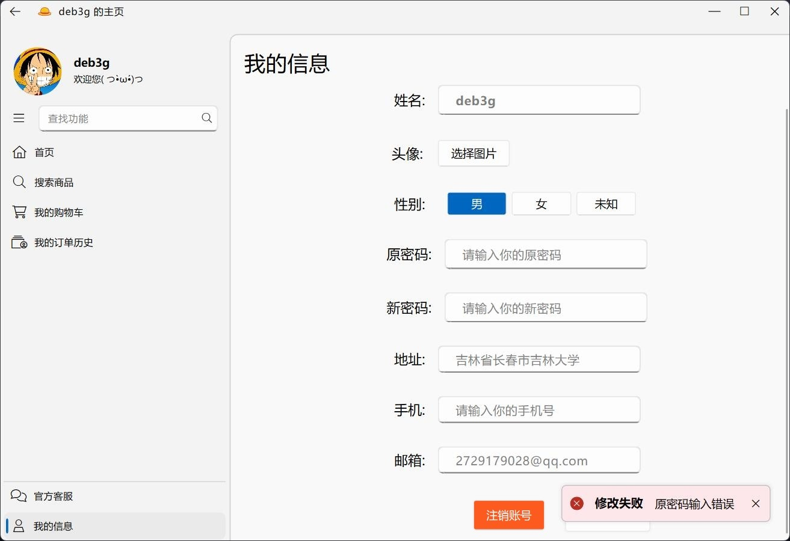
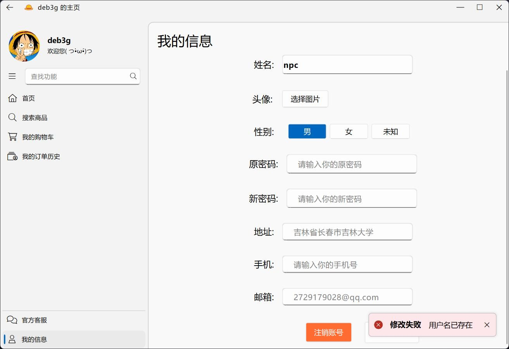
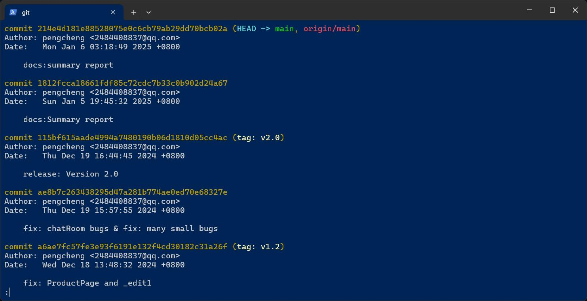

# 课设总结报告

## 一、需求分析

- 主要从服务端（Server）和客户端（Client）进行需求分析

### 1.1 Client 端

#### 1.1.1 注册与登录功能

- 注册账号

> 新账号注册，输入账号密码（必填）以及一些可填可不填的账户信息（手机号，邮箱，地址）。注册成功则自动跳转登录界面
>

- 登录账号

> 用户输入正确的账号与对于的密码，即可登录进入系统
>

- 联系客服

> 若忘记密码，可以以匿名者的身份联系客服，让管理员修改你的密码。

#### 1.1.2 商品检索功能

- 推荐商品功能

> 在首页轮转推荐商品，可以直接加入购物车。实现换一批功能，每次推荐一批商品在首页上。

- 商品的模糊搜索

> 通过模糊搜索（商品名或者简介中包含的关键词），找到想要找的商品。并可以点击并加入购物车。

#### 1.1.3 购物车功能

- 加入购物车功能

> 在上述的商品检索中，都可以加入购物车

- 购物车多选式的结算和删除

> 可以查看自己的购物车。
>
> 在购物车中，可以多选并执行结算、单个商品删除操作、调整购物车中商品的数量。

#### 1.1.4 历史记录功能

- 订单历史记录

>  可以查看历史记录。

- 退货

> 可以在此界面选择订单实现退货。

#### 1.1.5 客服功能

> 实现与 Server 端的客服交流的功能

#### 1.1.6 个人信息修改功能

> 实现修改个人信息，包括：姓名（不可重名），头像，性别，修改密码，地址，手机号，邮箱。


### 1.2 Server 端

#### 1.2.1 数据统计功能

> 首页展示两个图表：商品销量对比柱状图，商品销量占比饼状图。方便商家分析数据。

#### 1.2.2 商品检索功能

> 实现了类似 Client 端的模糊搜索。并可以点击修改商品信息。

#### 1.2.3 商品增改功能

> 相同的 UI 界面，可以填写空表实现商品的增加。也可以修改已有的商品信息。
>
> 可以在这个界面设置商品参与活动。促销策略提供模板选择，可以自定义折扣力度，数量等等
>
> 1. 直接折扣：打 xx 折
> 2. 满减活动：满 xx 减 yy
> 3. 买赠活动：买 xx 赠 yy
> 4. 限量促销：限量 xx 件 yy 元

#### 1.2.4 订单历史功能

> 查看所有的订单，显示时间状态。

#### 1.2.5 聊天功能

> 优先显示在线客户。每个客户都可以联系。收到消息会有红点提示。


## 二、系统设计

### 2.1 C/S 架构

- C/S（客户端/服务器）架构是一种分布式系统模型，其中客户端负责与用户交互，发送请求并显示结果，而服务器负责处理请求、管理数据和业务逻辑。
- 设计 Client 端和 Server 端，两端之间使用 TCP/IP 通信。
- C/S架构的优点是功能分离、效率高、安全性好，但也存在客户端依赖性强、扩展性受限等缺点。
- Client 端：实现业务层和 UI 界面，但是不允许访问数据库
- Server 端：实现业务层和 UI 界面，设计持久层负责和数据 库的连接与交互。


### 2.2 MVC 框架

- **MVC**是三个单词的缩写：

- - `M`，Model (模型)；
  - `V`，View (视图)，
  - `C`，Control (控制)。

- **Model层**：实现系统的业务逻辑
- **View层**：负责与用户交互，即在界面上展示数据对象给用户
- **Control层**：Model 与 View 之间沟通的桥梁，它可以分派用户的请求并选择恰当的视图以用于显示，同时它也可以解释用户的输入并将它们映射为模型层可执行的操作
- Client 端实现一个 `Allmain` 类（Control层），利用 QT 的信号与槽机制，负责处理所有 UI 类发送的信号，并传送给 Server 端。同时，也负责处理 Server 端发送来到讯息，并转义控制 UI 类。


### 2.3 持久层

- 持久层使用 C++ 模拟，用 Qt 中的 `QSqlDatabase` 和 `QSqlQuery` 访问数据库，并读取（写入）数据，转化成对象。
1. `QSqlDatabase` 负责与数据库建立连接，并管理数据库。我是用 `QSqlDatabase` 的 `QODBC` 驱动连接了 MySql 数据库。
2. `QSqlQuery` 负责执行Sql语句，通过执行(`QSqlQuery.exec()`) 可以完成写入，也能读取数据，并使用 `.next() .value()` 逐个读取数据，并手动转化成对象，完成持久层的任务。
3. 为实现秒杀功能，需要防止多个 `QSqlQuery` 同时访问数据库造成的资源竞争问题。我的解决办法是使用读写锁 `QReadWriteLock` 进行数据库读写控制。
   1. 在 `Allmain`(主类)中，声明并实例全局变量 `extern QReadWriteLock dbLock;`，所有数据库接口共用这一把锁。
   2. 在涉及到读数据库的 `QSqlQuery` 使用前，创建一个 `QReadLocker` 对象并传入一个 `QReadWriteLock` 引用初始化它 `QReadLocker locker(&dbLock);`。这样会自动尝试获取读锁，读锁不是独占的，当前没有人使用写锁则都可以进行读操作。使用 `QReadLocker` 会在对象生命周期结束时自动释放读锁。
   3. 在涉及到写数据库的 `QSqlQuery` 使用前，创建一个 `QWriteLocker` 对象并传入一个 `QReadWriteLock` 引用初始化它 `QWriteLocker locker(&dbLock);`。写锁是独占的，一个线程占用了写锁，则所有其他读写操作都无法进行。同样，使用 `QWriteLocker` 会在对象生命周期结束时自动释放写锁。


### 2.4 异步 socket 通讯

- 异步通讯的通信协议采用 TCP/IP 协议，并使用 Qt 的`QTcpSocket` 类和 `QTcpServer` 类实现异步通信。

1. `QTcpServer` 是 Server 端用于监听和接受TCP网络连接的类。当有客户端连接时，`QTcpServer` 会创建一个新的`QTcpSocket` 实例来与客户端进行通信，从而也就实现了服务器端与客户端的连接。
2. `QTcpSocket` 是用于处理TCP网络通信的类。可以发送和接收数据。支持异步通讯，是通信的基础实例类。

- 利用好 Qt 提供的信号与槽机制。可以实现很多功能，例如socket与用户的映射、用户在线列表，断连处理等。


### 2.5 多线程：并发和互斥

- 本项目使用了多线程提高程序的效率，实现了并发的处理多个 Client 端的请求
- 实现了线程池统一的管理线程，开源项目[ThreadPool](https://github.com/progschj/ThreadPool)，通过任务队列分配任务，通过条件变量实现线程同步。提高线程的效率与利用率
- 实现设计：
  - 接受到通讯请求，启动新的线程处理请求
  - 按照分隔符 `"\r\n"`, 分块读取信息, 分别处理.
  - 每次处理根据线程情况分配独异的"线程名", 利用这个"线程名"创立专用的数据库接口.

```c++
threadPool->enqueue([this, socket]{
    while(socket->bytesAvailable() > 0)
    {
        QByteArray buffer;
        buffer = socket->readAll();
        int cnt = 0;
        while (buffer.contains("\r\n"))
        {
            int index = buffer.indexOf("\r\n");
        QByteArray completeMsg=buffer.left(index);//提取完整消息
            buffer.remove(0, index + 2);
            QString threadName = QString::number(this->threadPool->getThreadName())+"_"+QString::number(cnt++);
            dealMessage(socket, completeMsg, threadName);
            QSqlDatabase::removeDatabase(threadName);
        }
    }
});
```

> 多线程注意事项：
> 1. 原因
>    1. 需要多线程的原因是多个 Client 端连接上 Server
>        时，在处理数据时会有很大的压力
>    2. 每个 Client 的请求都开一个新线程来处理，提高程序
>        效率，利用率，达到更好的负载均衡。
>    3. 再使用线程池来管理线程，让子线程不要空跑，提高
>        子线程的利用率。同时也能更好地管理，进行统一顺 序地上锁，注销。保障线程安全。
>    4. 线程池借鉴于 github 上的开源项目，我自己修改增
>        加了线程名称，用于标记不同的子线程。
> 2. 子线程限制
>    1. 不许直接操作 UI，否则线程会很慢
>    2. 不许使用 socket 通讯。这一点十分重要。在我的程
>       序中，我的解决办法是：
>       1. 当前线程需要发送请求时，发送信号，由主线程统
>           一处理，不阻塞子线程。
>    3. 不许使用主线程的数据库。由于数据库的接口越多越好，我的解决办法是：
>         1. 在每个线程开始时，才连接上数据库，并把这个接口以当前线程的名称标记。当前进程中只使用此接口。
>         2. 为数据库操作设计读写锁，防止资源竞争和冲突。
>         3. 处理完数据，及时删除这个接口和连接。


## 三、数据设计（类与通讯协议）

### 3.1 类的划分

#### 3.1.1 对象类 —— objects 模块

- objects.h

  ```c++
  //快速新建 object 的属性
  #define PROPERTY_CREATE_H(TYPE, M)                    \
  private: 										      \
      TYPE _##M;									 	  \
  public: 											  \
      void set##M(const TYPE &value)  { _##M = value; } \
      TYPE get##M() const { return _##M; }
  ```

- class Client    | 用户类

- class Product   | 商品类

- class Order     | 订单类

- class OrderList | 订单详情类

- class Shopping  | 购物车类

- class Chat      | 聊天记录类

> 该模块针对每一种需要用到的对象实现了一个类，并设计了类的成员函数。
>
> 我使用了宏函数来简化代码，更加高效地设计好了所有的对象。

#### 3.1.2 持久层类 —— dao 模块

- class Mapper 	     | 总表类
- class ClientMapper   | client表的持久层类
- class ProductMapper  | product表的持久层类
- class OrderMapper    | order表的持久层类
- class OrderListMapper| orderlist表的持久层类
- class ChatMapper     | chat表的持久层类
- class ShoppingMapper | shopping表的持久层类

> 该模块实现了持久层的任务，负责与数据库传输数据。
>
> Mapper 总表类，实现表的整体管理和删除。后续每个 mapper 都继承这个类。

#### 3.1.3 UI类 —— view 模块

- class BasePage 	      | UI基类
- Client 端：
  - class HomePage     | 首页
  - class SearchPage   | 搜索商品页
  - class ShoppingPage | 购物车页
  - class HistoryPage  | 订单历史页
  - class PersonPage   | 个人信息页
  - class LogIn        | 登录窗口
  - class SignIn       | 注册窗口
  - class ChatRoom     | 客服聊天窗口
- Server 端
  - class HomePage     | 首页
  - class SearchPage   | 搜索商品页
  - class ProductPage  | 商品详情增改页
  - class HistoryPage  | 订单历史页
  - class ChatPage     | 聊天页
  - class ChatRoom     | 聊天窗口

> BasePage 完成基础的页面设计。后续具体的每一个 Page 都继承 BasePage，并完成细化的设计实现。
>
> Page 页继承 `ElaScrollPage` 是主窗口上的一个页面。
>
> 窗口 继承 `ElaWidget` 是独立的窗口

#### 3.1.4 控制类 —— control 模块

- class QNChatMessage | 聊天信息控制类

> 实现聊天信息的时间处理，气泡外观处理等。并将一条 `QString` 信息处理成 `Chat` 类的对象实例

- class ObjectToJson  | 解析json类和转换json类

> 负责 socket 通讯时传输的 json 的编码和解码

- class ThreadPool    | 线程池类

> 负责实现线程池，管理线程

#### 3.1.5 业务类 —— model 模块

- class Allmain | 主类

> 主类，实现所有的业务层操作。包括：处理 socket 通讯，UI 管理，线程管理，实例线程锁等。


### 3.2 通讯协议设计

- 使用 socket 传输 `QByteArray`。字节数组存储的是 `QJsonDocument` (JSON文档由JSON格式的字符串生成)，利用JSON格式传输自己设计的对象类。

```c++
QByteArray ObjectToJson::changeJson(QJsonObject &object)
{
    QJsonDocument document;
    document.setObject(object);
    QByteArray byteArray = document.toJson(QJsonDocument::Compact); // 无空格
    byteArray.append("\r\n");   //分隔符
    return byteArray;
}
```

- JSON格式传输数据时都采用传送 `QList` 的形式，方便多个数据传输。以传输 `QString` 为例子。
- 编码JSON

```c++
QJsonObject ObjectToJson::addStrings(QJsonObject &object, QList<QString> strings)
{
    for (int i = 0; i < strings.size(); i++) {
        object.insert(QString("string%1").arg(i), strings[i]);
    }
    return object;
}
```

  - 解析JSON

```c++
QList<QString> ObjectToJson::parseStrings(QByteArray byteArray)
{
    QList<QString> ret;

    QJsonParseError jsonError;
    QJsonDocument doucment = QJsonDocument::fromJson(byteArray, &jsonError);
    if (!doucment.isNull() && (jsonError.error == QJsonParseError::NoError)){
        if (doucment.isObject()){
            QJsonObject object = doucment.object();
            for (int i = 0; ; i++)
            {
                QString name = QString("string%1").arg(i);
                if (object.contains(name)) {
                    QJsonValue value = object.value(name);
                    ret.append(value.toString());
                }
                else break;
            }
        }
    }
    return ret;
}
```

- 信号设计

```c++
//200 成功；302 重定向；403 拒绝；404 找不到；500 运行错误；
#define LOGIN 20010101  //登录请求，登录成功
#define LOGINFAIL 40410101 //登录失败：账号或密码错误
#define SIGNIN 20010201 //注册请求，注册成功
#define SIGNINFAIL 40410201  //注册失败：账号已存在
#define SIGNINERROR 30410201  //NULL
#define CHATMSG 20010301  //发送聊天信息
#define CHATHISTORY 20010302  //请求聊天历史
#define PERSONCHANGE 20010401 //修改个人账号，修改成功
#define PERSONCHANGEFAIL 40410401  //修改个人账号失败
#define PERSONCHANGEERROR 40310401 //修改个人密码错误
#define SEARCHPRODUCT 20010501 //搜索商品
#define REQUESTHOME 20010601 //首页请求
#define ADDSHOPPING 20010701  //加入购物车
#define REQUESTSHOPPING 20010702  //购物车请求
#define DELSHOPPING 20010703  //删除购物车
#define UPDATESHOPPING 20010704 //更新购物车
#define CREATEORDER 20010801  //创建订单
#define UPDATEORDER 20010802  //更新订单
#define CHECKORDER 20010803 //检查库存是否充足
#define CREATEORDERLIST 20010901  //创建订单List
#define REQUESTORDER 20011001   //请求订单历史
```


## 四、数据库设计


### 4.1 client 表

- 用户信息表

|      列名       |    备注    |       类型       | 是否NULL |        其他属性        |
| :-------------: | :--------: | :--------------: | :------: | :--------------------: |
|    client_id    |   客户id   |       int        | NOT NULL | 主键、无符号、自动递增 |
|   client_name   |  客户名称  |     varchar      | NOT NULL |          utf8          |
| client_password |  客户密码  |     varchar      | NOT NULL |          utf8          |
|   client_salt   |  客户盐值  |     varchar      | NOT NULL |          utf8          |
| client_address  |  客户地址  |     varchar      |   NULL   |          utf8          |
|  client_gender  |  客户性别  | enum{男,女,未知} | NOT NULL |    utf8、默认：未知    |
|  client_phone   | 客户手机号 |     varchar      |   NULL   |          utf8          |
|  client_email   |  客户邮箱  |     varchar      |   NULL   |          utf8          |
|  client_image   |  客户头像  |     varchar      |   NULL   |          utf8          |

- client_id 为主键且自动递增，作为识别客户的唯一关键。
- 用户名不能为空，性别无法置空（默认为“未知”），其余列可以为空。
- client_image 存照片的绝对地址，所有照片都是这种存法。头像默认为："C:/Users/PC/Desktop/ClassPro/MyPro/Client/include/Resource/T.jpg"
- 为了满足数据库中不能存密码明文的原则，我使用了sha256哈希加密算法，在数据库中存储密文。同时引入加盐值 salt 加强加密的安全性，保证两个密码即使一样，在加密之后也会不同。具体加密算法如下：

```c++
QString Allmain::generateRandomSalt(int length)
{
    QByteArray salt;
    salt.resize(length);
    for (int i = 0; i < length; ++i) {
        salt[i] = static_cast<char>(QRandomGenerator::global()->bounded(0, 256));
    }
    return QString::fromUtf8(salt.toHex());
}
```

- 生成了指定长度的 salt 值

```c++
QString Allmain::sha256Hash(const QString &data, const QString &salt)
{
    QByteArray combinedData = data.toUtf8() + salt.toUtf8();
    QByteArray hash = QCryptographicHash::hash(combinedData, QCryptographicHash::Sha256);
    return QString::fromUtf8(hash.toHex());
}
```

- 完成加盐 sha256哈希加密，同时保存成 hex 16进制形式。既处理了加密之后出现的 QString 无法打印的字符，又实现了定长，使格式更加整齐，方便后续需要。

- 为保证用户有一个默认头像，我设计了一个**触发器**。在插入或者更新时，若头像为null或者空，自动替换为默认头像地址

  ```sql
  BEGIN
      IF NEW.client_image IS NULL OR NEW.client_image = '' THEN
          SET NEW.client_image = "C:/Users/PC/Desktop/ClassPro/MyPro/Client/include/Resource/T.jpg";
      END IF;
  END
  ```


### 4.2 product 表

- 商品信息表

|       列名        |     备注     |           类型            | 是否NULL |        其他属性        |
| :---------------: | :----------: | :-----------------------: | :------: | :--------------------: |
|    product_id     |    商品id    |            int            | NOT NULL | 主键、无符号、自动递增 |
|   product_name    |   商品名称   |          varchar          | NOT NULL |          utf8          |
|   product_price   |   商品价格   |          double           | NOT NULL |         无符号         |
|    product_num    |   商品存量   |            int            | NOT NULL |    无符号、默认：0     |
|   product_sales   |   商品销量   |            int            | NOT NULL |    无符号、默认：0     |
|   product_about   |   商品描述   |           text            |   NULL   |          utf8          |
| product_strategy  | 商品促销策略 |enum{'0',<br />'1','2',<br />'3','4'} | NOT NULL |       默认：'0'        |
| product_discount1 | 商品折扣信息 |          double           |   NULL   |                        |
| product_discount1 | 商品折扣信息 |          double           |   NULL   |                        |
|   product_image   |   商品图片   |          varchar          |   NULL   |          utf8          |

- product_id 为主键且自动递增，作为识别商品的唯一关键。

- 商品名和商品价格不能为空，商品数量和商品销量无法置空（默认为0），商品折扣不能为空（默认为100，即不打折），其余列可以为空。

- 商品图片存储的是图片的绝对地

- 类似 client 表，若商品图片为null或空，使用**触发器**替换为默认图片地址

  ```sql
  BEGIN
      IF NEW.product_image IS NULL OR NEW.product_image = '' THEN
          SET NEW.product_image = "C:/Users/PC/Desktop/ClassPro/MyPro/Server/include/Resource/NULLProduct.jpg";
      END IF;
  END
  ```


### 4.3 shopping 表

- 购物车表

|      列名      |     备注     |  类型  | 是否NULL |        其他属性        |
| :------------: | :----------: | :----: | :------: | :--------------------: |
|  shopping_id   |   购物车id   |  int   | NOT NULL | 主键、无符号、自动递增 |
|   client_id    | 购物车所属者 |  int   |   NULL   |         无符号         |
|   product_id   |  购物车商品  |  int   |   NULL   |         无符号         |
|  shopping_num  |   商品数量   |  int   | NOT NULL |    无符号、默认：1     |
| shopping_price |   商品价格   | double | NOT NULL |         无符号         |

- product_id 为主键且自动递增
- 商品数量：客户希望购买多少件商品，非空，默认：1
- 商品价格：客户加入购物车时商品的价格，用于后续比较价格的变化，非空，不可修改
- client_id, product_id 为两个外键

| 字段       | 被引用表 | 被引用字段 | 删除时   | 更新时   |
| ---------- | -------- | ---------- | -------- | -------- |
| client_id  | client   | client_id  | SET NULL | RESTRICT |
| product_id | product  | product_id | SET NULL | RESTRICT |

- 通过外键，实现当用户或商品被删除时，对应的购物车被置空，造成逻辑删除。但是在后续商家统计数据时，该记录还可以利用。
- 新建一个视图方便购物车的逻辑查询

```mysql
SELECT * FROM shopping order by shopping.client_id
```

- 由于 client_id 的主键性质，在找到当前id之后，后续连续的商品都是该用户购物车中的商品，提高搜索效率。


### 4.4 order 表

- 订单记录表

|     列名     |     备注     |                   类型                    | 是否NULL |        其他属性        |
| :----------: | :----------: | :---------------------------------------: | :------: | :--------------------: |
|   order_id   |    订单id    |                    int                    | NOT NULL | 主键、无符号、自动递增 |
|  client_id   |  订单用户id  |                    int                    |   NULL   |         无符号         |
| product_num  | 订单商品数量 |                    int                    | NOT NULL |     无符号、默认0      |
| total_price  |   订单总价   |                  double                   | NOT NULL |         无符号         |
| order_status |   订单状态   | enum{'未支付','已完成','已取消','已退款'} | NOT NULL |          utf8          |
| create_time  | 订单下单时间 |                 datetime                  | NOT NULL |                        |
| finish_time  | 订单完成时间 |                 datetime                  | NOT NULL |                        |

- 订单在我的系统中属于“快照“，只会存下下单时相关属性，并不会更新。order_id 为主键且自动递增
- 订单快照中会存储：订单的总价，下单时间，完成时间以及订单状态。
- client_id 为外键

| 字段      | 被引用表 | 被引用字段 | 删除时   | 更新时   |
| --------- | -------- | ---------- | -------- | -------- |
| client_id | client   | client_id  | SET NULL | RESTRICT |

- 实现当客户被删除时，这条订单被逻辑删除，只作为数据统计


### 4.5 orderlist 表

- 订单记录详情表

|     列名      |    备注    |  类型  | 是否NULL |        其他属性        |
| :-----------: | :--------: | :----: | :------: | :--------------------: |
| orderlist_id  | 订单详情id |  int   | NOT NULL | 主键、无符号、自动递增 |
|   order_id    |   订单id   |  int   | NOT NULL |         无符号         |
|  product_id   |   商品id   |  int   |   NULL   |         无符号         |
|  product_num  |  商品数量  |  int   | NOT NULL |    无符号，默认：1     |
| product_price |  商品价格  | double | NOT NULL |         无符号         |

- orderlist_id 为主键且自动递增
- 商品数量：客户希望购买多少件商品，非空，默认：1
- 商品价格：客户加入购物车时商品的价格，用于后续比较价格的变化，非空，不可修改
- order_id, product_id 为外键

|    字段    | 被引用表 | 被引用字段 |  删除时  |  更新时  |
| :--------: | :------: | :--------: | :------: | :------: |
|  order_id  |  order   |  order_id  | RESTRICT | RESTRICT |
| product_id | product  | product_id | SET NULL | RESTRICT |

- 实现当商品被删除时，这条订单被逻辑删除，只作为数据统计
- 拒绝 order_id 被删除，实际上也不会被删除，加一道保险
- 新建一个视图方便订单详情的逻辑查询

```mysql
SELECT * FROM orderlist order by orderlist.order_id
```

- 实际查询逻辑与购物车类似，在找到当前id之后，后续连续的商品都是该用户购物车中的商品，提高搜索效率。


### 4.6 chat 表

- 聊天记录表

|     列名      |        备注        |   类型   | 是否NULL |        其他属性        |
| :-----------: | :----------------: | :------: | :------: | :--------------------: |
|    chat_id    |     聊天记录id     |   int    | NOT NULL | 主键、无符号、自动递增 |
|   client_id   |     聊天用户id     |   int    | NOT NULL |      无符号、外键      |
|   chat_text   |      聊天记录      |   text   | NOT NULL |          utf8          |
| chat_isserver | 是否客服发送的信息 | tinyint  | NOT NULL |        默认：0         |
|   chat_time   |      聊天时间      | datetime | NOT NULL |                        |

- search_id 为主键且自动递增
- chat_isserver 用于标记是 Server 发送的信息还是 Client 发送的。
- client_id 为外键

|   字段    | 被引用表 | 被引用字段 | 删除时  |  更新时  |
| :-------: | :------: | :--------: | :-----: | :------: |
| client_id |  client  | client_id  | CASCADE | RESTRICT |

- 这里有一个特殊设计：当用户被删除时，他的聊天记录也会被删除。为了尊重用户隐私，而且聊天记录没有利用价值。于是，聊天记录会随着 client_id 的删除而被删除。


## 五、需求实现与 UI 展示

### 5.1 Client 端

#### 5.1.1 注册与登录窗口

- 登录流程：

  - 用户输入账号密码，并点击“登录”按钮。
    - 若账号为空，报错提示
    - 若密码为空，报错提示
    - 否则向Server端通讯，携带信号和账号密码。Server端查询数据库。读取该账号的密码明文pwd和盐值salt。若找不到账号，向Client端返回报错。否则加密用户输入的密码，得到明文进行比对。比对成功向Client端返回成功，并携带client的详细信息。否则向Client端返回报错。成功登录，跳转到首页，并向`Allmain`传输client信息。
    - **便捷功能**：输入框清除按钮、按回车键可以代替点击“登录”按钮。
    - 加密算法使用了 **sha256哈希加密算法**，在数据库中存储密文。同时引入加盐值 salt 加强加密的安全性，保证两个密码即使一样，在加密之后也会不同。算法再数据库部分介绍过了。
  - 用户点击“注册账号”，跳转注册窗口。
  - 用户点击“联系客服”，跳转聊天窗口。
  - 设计了断连处理，在后文介绍。

  

- 登录窗口 UI

  

- 登录账号密码错误提示

  

- 登录密码为空提示

  

- 登录用户名为空提示

  

- 注册流程：

  - 用户输入账号、密码、手机号、邮箱、地址，并点击“注册账号”按钮。
    - 账号、密码为必填，若没填写会有报错。其他栏可选。
    - 向 Server 端通讯传输填写的内容。Server 端会先判断用户名是否重复。若重复则会通讯返回错误。不重复，生成盐值salt并形成密码明文，统一访问数据库存储。
    - 注册成功，携带账号返回登录界面。
  - 用户点击“返回登录”，返回登录窗口。

  

- 注册窗口 UI

  

- 注册用户名为空提示

  

- 注册密码为空提示

  

- 注册用户名已存在提示

  

#### 5.1.2 主窗口 —— 首页

- 首页：

  - 首页的卡片会轮状播放海报
  - 用户点击“换一换”，会更换两个展示的商品
    - 点击“换一换”按钮，Client 端发送 `REQUESTHOME` 信号给 Server 端。
    - Server 端收到信号，使用 `ProductMapper.selectRand()` 随机选择两个商品，并返回给 Client 端。
    - Client 端接收到返回信号，刷新首页。
  - 用户点击“加入购物车”，会将商品加入一份到购物车中

- **加入购物车功能**流程：

  - 点击“加入购物车”按钮之后，Client 端会将商品信息和用户信息整合成 `Shopping 类`，并发送 `ADDSHOPPING` 信号给 Server 端。Server 端接收到信息开始处理。
  - 先判断是新增还是累加。检查用户购物中是否已经存在该商品，使用 `ShoppingMapper.select()`。
    - 若存在，使用 `ShoppingMapper.update()`，更新购物车信息。
    - 若不存在，使用 `ShoppingMapper.insert()`，新增购物车信息。
  - Server 端返回加入购物车成功，Client 端提示“加入购物车成功”。

- 侧边栏点击：

  - 每个页面会向 Server 端发送对应的请求信号 `REQUESTSHOPPING`、`REQUESTORDER` 等。
  - Server 端处理出对应需要的数据，通讯返回 Client。Client 端进行初始化和跳转。

- 首页界面 UI

  

- 首页加入购物车成功

  

#### 5.1.3 主窗口 —— 搜索页面

- 商品搜索流程

  - 用户在搜索栏中输入，并点击“搜索”
    - 若输入为空，会展示所有商品。
    - 若输入不为空，会在商品名称和商品简介中进行模糊搜索。
      - 搜索“动物”：展示人人果实和牛牛果实，简介中有“动物”字眼。
      - 搜索“响雷果实”：展示响雷果实，名称包含字眼。
    - **便捷功能**：按回车键可以代替点击“搜索”按钮。
  - 用户点击加入购物车
    - 会将对应的商品加入购物车中，加入的流程在**5.1.2**中已经介绍过了。

- **搜索功能**流程：

  - Client 端将用户信息和搜索文本，发送 `SEARCHPRODUCT` 信号到 Server 端

  - Server 端接收到通讯，使用 `ProductMapper.selectLike()` 得到搜索结果，并返回给 Client 端。Client 端接收之后，刷新搜索页面并展示。

  - `ProductMapper.selectLike()` 使用Sql语句实现

    ```c++
    query.prepare("SELECT * FROM product WHERE product_name LIKE :name OR product_about LIKE :name");
    query.bindValue(":name", '%' + name + '%');
    ```

- 搜索页面 UI

  

- 搜索模糊搜索展示

  

  

- 加入购物车展示

  

#### 5.1.4 主窗口 —— 购物车界面

- 购物车流程

  - 用户点击多选框选择商品，并点击“去结算”按钮下单。
    - 若选择少于一个，报错
    - 若选择多于三个，报错
    - 否则跳转形成订单窗口。调用 `OrderPage` 的构造函数吗，传入选择的商品，并 `moveToCenter(); show();`，保证订单窗口置顶，处理一些信号与槽函数。
  - 用户点击“删除”按钮，从购物车中删除该商品。
  - 用户改变商品数量，购物车中改变商品数量。

- **购物车删除商品**流程：

  - 点击“删除”按钮之后，Client 端会将商品信息和用户信息整合成 `Shopping 类`，并发送 `DELSHOPPING` 信号给 Server 端。Server 端接收到信息开始处理。
  - 使用 `ShoppingMapper.update()`，更新购物车信息。
  - Server 端返回删除成功，Client 端提示“删除成功”。

- **购物车改变商品数量**流程：

  - 修改数量之后，Client 端会将商品信息和用户信息整合成 `Shopping 类`，并发送 `UPDATESHOPPING` 信号给 Server 端。Server 端接收到信息开始处理。
  - 使用 `ShoppingMapper.update()`，更新购物车信息。

- 购物车页面 UI

  

- 购物车选择（可多选）展示

  

- 购物车删除功能展示

  

- 购物车未选择报错

  

- 购物车选择过多报错

  

#### 5.1.5 订单窗口

- 订单流程

  - 用户点击“确定下单”按钮。
  - 判断库存是否充足，将 `Order` 向 Server 端发送 `CHECKORDER` 信号。
  - Server 端处理，判断库存是否充足
  - 若库存不足，报错。
  - 若库存充足，调用 `payDialog`。形成订单，状态为**“未支付”**，删除用户购物车中对应的商品，并临时占用商品的库存。
    - `CHECKORDER` 信号处理时，就占用库存和销量。
    - 将 `Order` 和对应的 `OrderList` 向 Server 端发送 `CHECKORDER` 和 `CREATEORDERLIST`，Server 使用 `OrderMapper.insert()` 插入数据库中，并向 Client 端返回订单号oid。
    - 将 `Order` 整合成 `Shopping`，向 Server 端发送 `DELSHOPPING` 信号，Server 端使用 `ShoppingMapper.delet()`，删除购物车。
  - `payDialog` 中，用户点击“确定支付”。
    - 修改订单状态为**“已支付”**
    - 将 `Order` 向 Server 发送 `UPDATEORDER` 信号。Server 端使用 `OrderMapper.update()` 更新订单状态。
  - `payDialog` 中，用户点击“取消订单”。
    - 修改订单状态为**“已取消”**
    - 将 `Order` 向 Server 发送 `UPDATEORDER` 信号。Server 端使用 `OrderMapper.update()` 更新订单状态。
    - 额外需要使用 `ProductMapper.uopdate()`，恢复临时占用的库存和销量。

- 订单窗口 UI

  

- 订单库存不足

  

- 订单下单提示

  

- 订单下单完成

  

- 订单取消下单

  

#### 5.1.6 主窗口 —— 订单历史页面

- 订单历史流程
- 若没有买商品，单独显示
  - 若订单状态是“已取消”或“未支付”，按钮不可点击。
  - 若订单状态是“已退款”，按钮为已退款。
  - 用户点击“退款”按钮
    - `Order` 状态修改为**“已退款”**。
    - 将 `Order` 向 Server 发送 `UPDATEORDER` 信号。Server 端使用 `OrderMapper.update()` 更新订单状态。

- 订单历史页面 UI

  

- 没有订单历史

	

- 订单退货

  

#### 5.1.7 主窗口 —— 个人信息页面

- 个人信息流程

  - 如果修改密码，需要先输入原密码，再输入新密码。

    - 整合数据生成新 client 同时传输原密码。

  - 如果修改用户名，需要判断用户名是否重复。

  - 向 Server 端发送 `PERSONCHANGE` 信号。先使用 `ClientMapper.select(int)` 获取原有数据。

  - 比较用户名，如果修改了需要使用 `ClientMapper.select(QString)` 判断是否有重复的用户名。若有，通讯返回报错。

  - 判断传输的数据中是否有原密码（代表了是否需要修改密码）。使用**加密算法**和原有数据比较判断密码是否正确。若不正确，通讯返回报错。

  - 使用 `ClientMapper.update()` 修改其他数据。

  - 注销用户会让用户再次确定

    - 若确定，携带 client 数据向 Server 端发送 `PERSONDELET` 信号，删除用户。由于数据库的外键设计，chat 表中的聊天记录也会自动删除。
    - 程序会返回登录界面。实现是重启程序，先启动一个新的进程包含当前的程序。再关闭当前的应用程序。

    ```c++
    QString program = QCoreApplication::applicationFilePath();
    QStringList arguments = QCoreApplication::arguments();
    arguments.removeFirst();
    QProcess::startDetached(program, arguments);
    QCoreApplication::quit();
    ```


- 信息页面 UI

  

- 信息修改成功

  

- 信息修改密码错误报错

  

- 信息修改用户名重复报错

  

- 注销用户确定窗口

  

- 注销数据库自动处理

  

  

  

#### 5.1.8 聊天窗口

- 使用了 [Demo_MessageChat_Qt](https://github.com/ShaShiDiZhuanLan/Demo_MessageChat_Qt) 生成气泡框。

- 初始化向 Server 端发送 `CHATHISTORY` 信号。Server 端使用 `ChatMapper.select()` 读取用户的聊天记录并通讯返回。Client 端刷新展示。

- 点击“发送”按钮，展示信息。同时，将信息向Server 端发送 `CHATMSG` 信号。Server 端使用 `ChatMapper.insert()` 将信息加入数据库中。

- 聊天窗口 UI

  

- 匿名聊天

  

#### 5.1.9 断开连接处理

- 断开连接流程

  - 当 `socketState == QAbstractSocket::UnconnectedState`，表示断开连接了。
  - `foreach()` 遍历所有窗口，找到 `isVisible()` 的窗口。
    - 若窗口是 `LogIn`，调用 `LogIn.unconnected()`
    - 若窗口是 `SignIn`，`SignIn.unconnected()`
    - 若窗口是其他，当前窗口 `hide()`，`LogIn.show(); LogIn.unconnected()`

- 登录断开连接 UI

  

- 注册断开连接 UI

  

### 5.2 Server 端

#### 5.2.1 主窗口 —— 首页

- 首页图表使用 `QChart` 和 `QChartView`，生成一张Bar图和一张Pie图。

- Bar图展示不同商品销量的对比

- Pie图展示不同商品总销量的占比

- 首页 UI

  

#### 5.2.2 主窗口 —— 搜索页面

- 与 Client 端的搜索界面**5.1.3**相似。加入购物车改成修改商品，点击携带商品信息，跳转到商品增改页面。

  

#### 5.2.3 主窗口 —— 商品增改页面

- 四种活动：

  1. 直接折扣：打 xx 折
  2. 满减活动：满 xx 减 yy
  3. 买赠活动：买 xx 赠 yy
  4. 限时促销：限时打 xx 折扣

- 商品合法化判断

  - 新增商品，名称、价格、库存必填
  - 额外会判断价格为数字（浮点数或者整数），库存为整数。
  - 活动会判断是否合法。
  - 简介不能超过30字。

- 增改流程：

  - 新增：`ProductMapper.insert()`，访问数据库。
  - 修改：`ProductMapper.update()`，访问数据库。
  - 删除：`ProductMapper.delet()`，访问数据库。

- 商品新增页面 UI

  

- 商品修改页面 UI

  

- 商品活动选择

  

  

  

  

  

- 商品新增成功

  

- 商品修改成功

  

- 商品删除成功

  

- 商品新增未设置名称

  

- 商品新增未设置价格

  

- 商品新增未设置库存

  

- 商品修改价格非法（须输入数字）

  

- 商品修改库存非法（须输入整数）

  

- 商品设置活动非法

  

- 商品修改活动数字非法

  

- 商品设置简介过长

  

#### 5.2.4 主窗口 —— 订单历史页面

- 订单历史流程

  - 使用 `OrderMapper.select()` 结合 `OrderListMapper.select()` 直接访问数据库, 读取所有订单

- 订单历史页面 UI.

  

#### 5.2.5 主窗口 —— 聊天页面

- 聊天选择流程

  - 利用 socket 连接时存储的 `HashMap` 表,判断哪些用户现在正在线, 优先显示. 展示时, 使用 `ClientMapper.select()` 直接访问数据库, 读取用户信息
  - 点击"联系他", 跳转到聊天窗口

- 聊天页面 UI

  

- 聊天在线页面

  

#### 5.2.6 聊天窗口

- 与 Client 端的聊天窗口相同

- 聊天窗口 UI

  

## 六、其他项目相关

- git

  - 在我完成项目的过程中，我使用了 git 进行版本控制和存档。同时，上传至 GitHub 记录下了工作的过程。

  

- [ElaWidget](https://github.com/Liniyous/ElaWidgetTools)

  - 使用了 GitHub 上的开源项目 ElaWidget，用于美化 UI 界面。
  - 该项目是基于 QT-Widget 开发的 FluentUI 风格的组件库。在正常使用 Qt 的 UI 组件时，套用他的组件库可以拥有更多的拓展功能和美化选项。

- [ThreadPool](https://github.com/progschj/ThreadPool)

  - 使用了 GitHub 上的开源项目 ThreadPool，实现了线程池，用于管理线程。
  - 该项目是基于 C++11 开发的 线程池。我为他额外增加了获取独异的线程名称功能，用于区分不同的线程。

- [Demo_MessageChat_Qt](https://github.com/ShaShiDiZhuanLan/Demo_MessageChat_Qt)

  - 使用了 GitHub 上的开源项目 Demo_MessageChat_Qt，实现了聊天窗口的气泡显示 UI

## 七、不足的方面

- 设计模式的缺陷
  - 虽然强行分了模块，但是其实划分并不清晰，不少模块之间耦合性很强。
  - 层次之间也区分不明显，M层与C层经常混为一谈，没有提前的规划和学习。
- DAO 层的缺陷
  - 并未使用 Web 服务去连接专门的持久层，类似 Java的Mybatis框架。而只是使用 Qt 的 `QSqlDatabase` 手写实现了一个“伪”持久层，直接使用了 Sql 语言实现了数据抽象，数据访问和对象映射。
  - 未使用 Web 服务，导致程序的扩展性大大降低。只能使用局域网实现 Client 端和 Server 端的连接。通讯协议设计的相对简单，传输效率较低。
  - 图片传输处理问题很大，我直接传输的是图片在本机的地址。完全没有扩展性（或者可以改成存储在服务器中的地址）。可能更应该传输 url，并存储为 BLOB 在数据库中。
- 程序效率问题
  - 由于 DAO 层是自己手写的，查询效率极低，没有优化。
  - 程序没有经过大量访问的压力测试，稳定性和性能状况未知。针对高并发的优化，不知道是否有效。