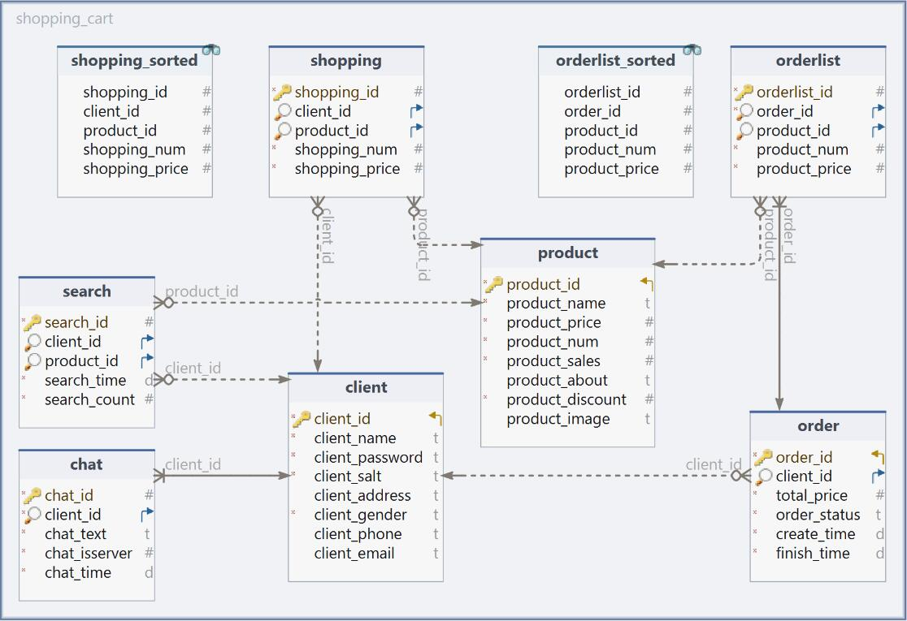

# 微商系统の需求与设计

## Client 端

### 1. 注册与登录

- 注册账号

> 新账号注册，输入账号密码（必填）以及一些可填可不填的账户信息（如手机号，邮箱，地址等）。注册成功则自动跳转登录界面
>
> 通过 socket 通讯实现以上功能，将输入的信息传回 Server 端。Server 端在业务层确认合法注册之后，生成唯一的 uid 识别码，并存入数据库中。Server 端返回注册成功或者失败的信息。

- 登录账号

> 用户输入正确的账号与对于的密码，即可登录进入系统
>
> 同样是发出 socket 请求到 Server 端。Server 端找到数据库中的账号，以及对应的密码，进行判断，并返回登录成功或者失败的信息。

- 用户信息修改

> 登录进去之后可以修改个人信息
>
> 同样是发出 socket 请求到 Server 端。具体的合法化与处理在 Server 端进行。


### 2. 商品检索功能

#### 2.1 商品的模糊搜索

- 通过模糊搜索，及时给出搜索提示，找到想要找的商品。并可以点击进入商品页，查看详细信息，并加入购物车或者直接购买。

> 实时与 Server 端通信，并返回查询结果，查询过程在 Server 端完成。

#### 2.2 推荐商品功能

- 在首页轮转推荐商品，可以点击跳转
- 实现换一批功能，每次推荐一批商品在首页上。

> 利用 Qt 中信号与槽的功能，可能需要多线程操作。点击后跳转到对应编号的界面。主页上放置若干容器，在点击“换一批”之后，更换容器的内容。更换时，是向 Server 端发送请求，并展示 Server 端传回的商品数据。

#### 2.3 促销商品推荐

- 首页最醒目位置放置促销商品，同样支持跳转

> 最醒目位置放置几个容器，用于展示促销商品。针对不同的促销策略，再做不同展示方式。
>
> 进入首页时，向 Server 端发送请求，展示传回的促销商品数据。


### 3. 购物车功能

#### 3.1 加入购物车功能

- 在商品详情界面可以选择商品的属性，并加入购物车

> 选好商品属性后，将数据发送到 Server 端。Server 端处理数据，加入该用户的购物车中。返回加入成功。

#### 3.2 购物车多选式的结算和删除

- 可以查看自己的购物车，在购物车中也可以跳转商品详情。
- 在购物车中，可以多选并执行结算或者删除操作。

> 同样是整合数据发送往 Server 端，检查合法之后，返回购买成功或者删除成功。


### 4. 历史记录功能

#### 4.1 订单历史记录

- 可以查看历史记录，双击可以跳转商品详情
- 可以在此界面实现多选式退货
- 不可删除记录

> 记录是存在数据库中的，进入界面时需要向 Server 端请求。查看商品实现跳转指定商品编号界面。
>
> 退款：同样是整合数据发送往 Server 端，检查合法之后，返回退货成功。

#### 4.2 搜索浏览历史记录

- 搜索完成并点击进入商品之后，记录这一条记录
- 允许双击跳转，允许删除

> 同样是向 Server 端请求，得到数据。查看商品实现跳转指定商品编号界面。
>
> 删除记录时也是向 Server 端请求，得到删除成功刷新记录。


### 5 客服功能

- 实现与 Server 端的客服交流的功能
- 若有新消息会有提醒

> 通过异步 socket 进行实时通信。在 socket 通信时，实时更新聊天内容，若有更新则提醒。


### 6. UI界面

- 首页


- 会比这个 UI 窄一点
- 其他 UI界面平铺即可

## Server 端

Server 端其实分为两个部分：业务层 + 持久层和商店端

业务层需要处理数据，而持久层则负责与数据库交互

商店端理论上也是一个 Client 端，只是需求与权限与客户端完全不同。需要独立的 UI 以及需求设计

### 1. 业务层 + 持久层

- 回应 Client，读取 Client 发送的请求，并返回数据

> 包括处理登录请求，注册请求，购买请求，退货请求，以及各类数据请求（商品查询，促销商品，聊天记录等各类记录）。
>
> 这些响应商店端无法操作处理修改，由系统自动完成并返回。

- 系统做数据处理，并与数据库交互

> 数据库结构后续详细设计

### 2. 商店端：商品操作需求

- 查询商品

> 类似 Client 端的模糊搜索，可以跳转商品详情

- 新增、修改商品

> 这两个操作的逻辑是一样的，可以设计一样的UI界面。
>
> 新增则生成唯一的 uid，并且不允许修改。修改则读取当前 uid 的商品，展示出来并允许修改。
>
> 也可以在查询之后，选择修改

- 删除商品
> 可以在查询之后，选择删除。在详情界面也可以选择删除

### 3. 客户端：客服交流需求

- 类似 Client 端的交流需求

### 4. 客户端：活动需求

- 新建促销活动，添加活动商品，添加促销策略，折扣。

> 添加商品的操作结合查询商品的操作
>
> 促销策略提供模板选择，可以自定义折扣力度，时长等等
>
> 需要额外考虑秒杀的实现（高并发多线程）

### 5. 客户端：数据统计需求

- 统计商品销售量，商品销售占比，销售变化量等等
- 查看销售历史记录，历史详情

> 可以考虑从多个视角生成图表展示数据（柱状图，折线图，饼状图等等）


## 数据库设计




### 1. client 表

- 用户信息表

|      列名       |    备注    |       类型       | 是否NULL |        其他属性        |
| :---------: | :--------: | :---------: | :---------: | :-----------------------: |
|    client_id    |   客户id   |       int        | NOT NULL | 主键、无符号、自动递增 |
|   client_name   |  客户名称  |   varchar   | NOT NULL |          utf8          |
| client_password |  客户密码  |   varchar   | NOT NULL |          utf8          |
|   client_salt   |  客户盐值  |   varchar   | NOT NULL |          utf8          |
| client_address  |  客户地址  |   varchar   |   NULL   |          utf8          |
|  client_gender  |  客户性别  | enum{男,女,未知} | NOT NULL |    utf8、默认：未知    |
|  client_phone   | 客户手机号 |   varchar   |   NULL   |          utf8          |
|  client_email   |  客户邮箱  |   varchar   |   NULL   |          utf8          |

- client_id 为主键且自动递增，作为识别客户的唯一关键。
- 用户名不能为空，性别无法置空（默认为“未知”），其余列可以为空。

- 为了满足数据库中不能存密码明文的原则，我使用了sha256哈希加密算法，在数据库中存储密文。同时引入加盐值 salt 加强加密的安全性，保证两个密码即使一样，在加密之后也会不同。具体加密算法如下：

```c++
QString Allmain::generateRandomSalt(int length)
{
    QByteArray salt;
    salt.resize(length);
    for (int i = 0; i < length; ++i) {
        salt[i] = static_cast<char>(QRandomGenerator::global()->bounded(0, 256));
    }
    return QString::fromUtf8(salt.toHex());
}
```

- 生成了指定长度的 salt 值

```c++
QString Allmain::sha256Hash(const QString &data, const QString &salt)
{
    QByteArray combinedData = data.toUtf8() + salt.toUtf8();
    QByteArray hash = QCryptographicHash::hash(combinedData, QCryptographicHash::Sha256);
    return QString::fromUtf8(hash.toHex());
}
```

- 完成加盐 sha256哈希加密，同时保存成 hex 16进制形式。既处理了加密之后出现的 QString 无法打印的字符，又实现了定长，使格式更加整齐，方便后续需要。


### 2. product 表

- 商品信息表

|       列名       |   备注   |  类型   | 是否NULL |        其他属性        |
| :--------------: | :------: | :-----: | :------: | :--------------------: |
|    product_id    |  商品id  |   int   | NOT NULL | 主键、无符号、自动递增 |
|   product_name   | 商品名称 | varchar | NOT NULL |          utf8          |
|  product_price   | 商品价格 | double  | NOT NULL |         无符号         |
|   product_num    | 商品存量 |   int   | NOT NULL |    无符号、默认：0     |
|  product_sales   | 商品销量 |   int   | NOT NULL |    无符号、默认：0     |
|  product_about   | 商品描述 |  text   |   NULL   |          utf8          |
| product_discount | 商品折扣 |   int   | NOT NULL |   无符号、默认：100    |
|  product_image   | 商品图片 | varchar |   NULL   |          utf8          |

- product_id 为主键且自动递增，作为识别商品的唯一关键。
- 商品名和商品价格不能为空，商品数量和商品销量无法置空（默认为0），商品折扣不能为空（默认为100，即不打折），其余列可以为空。
- 商品折扣为 int 整数（$discount \in [0, 100]$），实际计算时`price * discount / 100.0`
- 商品图片存储的是图片的绝对地址


### 3. shopping 表

- 购物车表

|      列名      |     备注     |  类型  | 是否NULL |        其他属性        |
| :------------: | :----------: | :----: | :------: | :--------------------: |
|  shopping_id   |   购物车id   |  int   | NOT NULL | 主键、无符号、自动递增 |
|   client_id    | 购物车所属者 |  int   |   NULL   |         无符号         |
|   product_id   |  购物车商品  |  int   |   NULL   |         无符号         |
|  shopping_num  |   商品数量   |  int   | NOT NULL |    无符号、默认：1     |
| shopping_price |   商品价格   | double | NOT NULL |         无符号         |

- product_id 为主键且自动递增
- 商品数量：客户希望购买多少件商品，非空，默认：1
- 商品价格：客户加入购物车时商品的价格，用于后续比较价格的变化，非空，不可修改

- client_id, product_id 为两个外键

| 字段       | 被引用表 | 被引用字段 | 删除时   | 更新时   |
| ---------- | -------- | ---------- | -------- | -------- |
| client_id  | client   | client_id  | SET NULL | RESTRICT |
| product_id | product  | product_id | SET NULL | RESTRICT |

- 通过外键，实现当用户或商品被删除时，对应的购物车被置空，造成逻辑删除。但是在后续商家统计数据时，该记录还可以利用。
- 新建一个视图方便购物车的逻辑查询

```mysql
SELECT * FROM shopping order by shopping.client_id
```

- 由于 client_id 的主键性质，在找到当前id之后，后续连续的商品都是该用户购物车中的商品，提高搜索效率。


### 4. order 表

- 订单记录表

|     列名     |     备注     |                        类型                        | 是否NULL |        其他属性        |
| :----------: | :----------: | :------------------------------------------------: | :------: | :--------------------: |
|   order_id   |    订单id    |                        int                         | NOT NULL | 主键、无符号、自动递增 |
|  client_id   |  订单用户id  |                        int                         |   NULL   |         无符号         |
| total_price  |   订单总价   |                       double                       | NOT NULL |         无符号         |
| order_status |   订单状态   | enum{'未支付','已支付','已完成','已取消','已退款'} | NOT NULL |          utf8          |
| create_time  | 订单下单时间 |                      datetime                      | NOT NULL |                        |
| finish_time  | 订单完成时间 |                      datetime                      | NOT NULL |                        |

- 订单在我的系统中属于“快照“，只会存下下单时相关属性，并不会更新。order_id 为主键且自动递增
- 订单快照中会存储：订单的总价，下单时间，完成时间以及订单状态。
- client_id 为外键

| 字段      | 被引用表 | 被引用字段 | 删除时   | 更新时   |
| --------- | -------- | ---------- | -------- | -------- |
| client_id | client   | client_id  | SET NULL | RESTRICT |

- 实现当客户被删除时，这条订单被逻辑删除，只作为数据统计


### 5. orderlist 表

- 订单记录详情表

|     列名      |    备注    |  类型  | 是否NULL |        其他属性        |
| :-----------: | :--------: | :----: | :------: | :--------------------: |
| orderlist_id  | 订单详情id |  int   | NOT NULL | 主键、无符号、自动递增 |
|   order_id    |   订单id   |  int   | NOT NULL |         无符号         |
|  product_id   |   商品id   |  int   |   NULL   |         无符号         |
|  product_num  |  商品数量  |  int   | NOT NULL |    无符号，默认：1     |
| product_price |  商品价格  | double | NOT NULL |         无符号         |

- orderlist_id 为主键且自动递增
- 商品数量：客户希望购买多少件商品，非空，默认：1
- 商品价格：客户加入购物车时商品的价格，用于后续比较价格的变化，非空，不可修改
- order_id, product_id 为外键

|    字段    | 被引用表 | 被引用字段 |  删除时  |  更新时  |
| :--------: | :------: | :--------: | :------: | :------: |
|  order_id  |  order   |  order_id  | RESTRICT | RESTRICT |
| product_id | product  | product_id | SET NULL | RESTRICT |

- 实现当商品被删除时，这条订单被逻辑删除，只作为数据统计
- 拒绝 order_id 被删除，实际上也不会被删除，加一道保险
- 新建一个视图方便订单详情的逻辑查询

```mysql
SELECT * FROM orderlist order by orderlist.order_id
```
- 实际查询逻辑与购物车类似，在找到当前id之后，后续连续的商品都是该用户购物车中的商品，提高搜索效率。


### 6. search 表

- 搜索记录表

|     列名     |     备注     |   类型   | 是否NULL |        其他属性        |
| :----------: | :----------: | :------: | :------: | :--------------------: |
|  search_id   |  搜索记录id  |   int    | NOT NULL | 主键、无符号、自动递增 |
|  client_id   |  搜索用户id  |   int    |   NULL   |         无符号         |
|  product_id  |  搜索商品id  |   int    |   NULL   |         无符号         |
| search_time  | 最新搜索时间 | datetime | NOT NULL |                        |
| search_count |   搜索次数   |   int    | NOT NULL |    无符号，默认：1     |

- search_id 为主键且自动递增
- 搜索时间存储最近一次搜索的时间
- 搜索记录需要实现合并功能，同一个用户搜索的同一个商品，不新生成记录，而是与之前的记录合并。
- client_id, product_id 为两个外键

| 字段       | 被引用表 | 被引用字段 | 删除时   | 更新时   |
| ---------- | -------- | ---------- | -------- | -------- |
| client_id  | client   | client_id  | SET NULL | RESTRICT |
| product_id | product  | product_id | SET NULL | RESTRICT |

- 通过外键，实现当用户或商品被删除时，对应的购物车被置空，造成逻辑删除。但是在后续商家统计数据时，该记录还可以利用。


### 7. chat 表

- 聊天记录表
|     列名      |        备注        |   类型   | 是否NULL |        其他属性        |
| :-----------: | :----------------: | :------: | :------: | :--------------------: |
|    chat_id    |     聊天记录id     |   int    | NOT NULL | 主键、无符号、自动递增 |
|   client_id   |     聊天用户id     |   int    | NOT NULL |      无符号、外键      |
|   chat_text   |      聊天记录      |   text   | NOT NULL |          utf8          |
| chat_isserver | 是否客服发送的信息 | tinyint  | NOT NULL |        默认：0         |
|   chat_time   |      聊天时间      | datetime | NOT NULL |                        |

- search_id 为主键且自动递增
- chat_isserver 用于标记是 Server 发送的信息还是 Client 发送的。
- client_id 为外键

|   字段    | 被引用表 | 被引用字段 | 删除时  |  更新时  |
| :-------: | :------: | :--------: | :-----: | :------: |
| client_id |  client  | client_id  | CASCADE | RESTRICT |

- 这里有一个特殊设计：当用户被删除时，他的聊天记录也会别删除。为了尊重用户隐私，而且聊天记录没有利用价值。于是，聊天记录会随着 client_id 的删除而被删除。